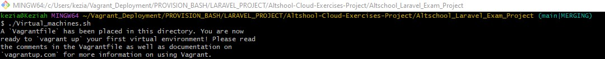
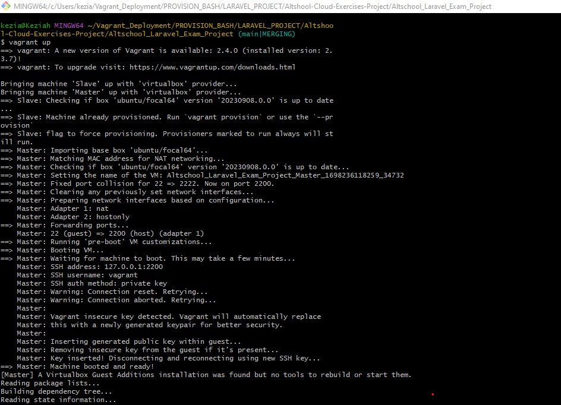

# TITLE: Automated Deployment of Laravel with PostgreSQL on Two Virtual Machines with GitHub Cloning and Cron Job Integration.

# Author: EMMANUEL KEZIAH

# Date Created: 21-Oct-2023
#========================================================================================================================================================================
# TABLE OF CONTENTS
# 1. Introduction
+ Purpose of Documentation
+ Prerequisites

# 2. Installation
+ Installing VirtualBox 
+ Installing Vagrant
+ Initializing Vagrant

# 3. Configurations
+ Defining virtual machines
+ Starting Virtual Machines

# 4. Provisioning Scripts
+ Provisioning Virtual Machine:
    + Deploying LAMPstack
        + Installing Apache2
        + Installing MySQL
        + Installing PHP and its modules
        + Modify php.ini file
        + Error handling and debugging
        
# 5. COMPOSER
+ Installing curl
    + Installing Composer

# 6. APACHE CONFIGURATIONS
    + Configuring Apache Server
       + Enabling Apache Modules
       + Configuring laravel.conf file
       + Enabling Apache2 Rewrite Module


# 7. GIT CLONE LARAVEL APPLICATION
    + Creating directory for laravel application on the server
    + Setting Ownership and Permissions of the directory


# 8. MYSQL CONFIGURATIONS
    + Configuring MySQL
        + Creating Database
        + Creating Database User
        + Granting Privileges to Database User
        + Flushing Privileges
        + Restarting MySQL Service

# 9. Vagrant Commands
+ `vagrant up`
+ `vagrant halt`
+ `vagrant destroy`
+ `vagrant ssh`
+ `vagrant provision`

# 10. Troubleshooting
+ Common Errors
+ Debugging

# 11. Conclusion
+ Summary
+ References


#========================================================================================================================================================================
# 1. Introduction
## Purpose of Documentation:
This documentation is intended to provide a step-by-step guide on how to deploy a Laravel application with PostgreSQL on two virtual machines using Vagrant. The documentation will also cover the installation of LAMPstack, Git, and Composer. The virtual machines will be provisioned with a bash script that will clone a GitHub repository and create a cron job to run the Laravel scheduler every minute. The documentation will also cover the configuration of the virtual machines, the installation of the required software, and the testing of the environment.

## Prerequisites:
+  Vagrant
+  VirtualBox
+  Text Editor  (e.g. Visual Studio Code, Sublime Text, Atom, etc.)
+ Basic knowledge of Linux commands
+ Basic knowledge of Laravel
+ Basic knowledge of Git

# 2. Installation
## Installing VirtualBox:
1. Download the latest version of VirtualBox from the official website: https://www.virtualbox.org/wiki/Downloads if you do not already have it installed on your machine.
2. Run the installer and follow the instructions to install VirtualBox on your machine.

## Installing Vagrant:
1. Download the latest version of Vagrant from the official website: https://www.vagrantup.com/downloads.html if you do not already have it installed on your machine.
2. Run the installer and follow the instructions to install Vagrant on your machine.
3. If you are using the terminal to install Vagrant, you can use the following commands:
    + `sudo apt-get update`:
    This will update the system.
    + `sudo apt-get install vagrant`
    This will install the latest version of Vagrant on your machine. 

    ## Initializing Vagrant:
     In order to initialize Vagrant, you will need to create a directory for your project. You can do this by using the following command:
    + `mkdir <directory_name>`: in this case, the directory name will be `Vagrant_Deployment`.

    + `cd <directory_name>`: this will change the directory to the newly created directory. You can use the `touch` command to create the necessary files in the directory and the `ls` command to list the files in the directory.

    + `vagrant init`: this will initialize Vagrant  and create a `Vagrantfile` in the directory. in this case, `./virtual_machines.sh` will be used to initialize Vagrant and create the `Vagrantfile` in the directory.

    + `vagrant up`: this will start the virtual machines and provision them with the bash script. in this case, `./virtual_machines.sh` will be used to start the virtual machines and provision them with the bash script for the master and slave virtual machines.
        The illustration below shows the commands used to initialize Vagrant and start the virtual machines:
        

        


    # 3. Configurations
    ## Defining virtual machines:
    In order to define the virtual machines, you can either edit the vagrant file or create a bash script to define the virtual machines. In this case, a bash script will be used to define the virtual machines. The bash script will be named `virtual_machines.sh` and will be located in the `Vagrant_Deployment` directory. The bash script will contain the following code:

    ```
    #!/bin/bash
    cat <<EOF > Vagrantfile
    Vagrant.configure("2") do |config|
    config.vm.define "Slave" do |slave|
        slave.vm.box = "ubuntu/focal64"
            slave.vm.hostname = "SlaveBox"

            # Customize the amount of memory on the VM:
            slave.vm.provider "virtualbox" do |virtualbox|
            virtualbox.memory = "1024"
            virtualbox.cpus = "1"
            end
            # Other configuration(network, port forwarding, e.t.c) goes here...
            slave.vm.provision "shell", inline: <<-SHELL
            # Add scripts to update the system and install the required software here...
            SHELL
        end

        # Use the SHELL block to add shell commands to your Vagrantfile and close the shell block with a `SHELL`  and `end` statement.
        

        config.vm.define "Master" do |master|
            master.vm.box = "ubuntu/focal64"
            master.vm.hostname = "MasterBox"

            # Customize the amount of memory on the VM:
            master.vm.provider "virtualbox" do |virtualbox|
            virtualbox.memory = "1024"
            virtualbox.cpus = "1"
            end
            # Other configuration(network, port forwarding, etc.) goes here...
        end
        master.vm.provision "shell", inline: <<-SHELL
        # Add scripts to update the system and install the required software here...
       SHELL
    end
    EOF

# Explanation of the code:
- The code above will define two virtual machines: `Master` and `Slave` . The script define the hostname, networking configurations, and the amount of memory allocated to the virtual machines. The script will also provision the virtual machines with a bash script that will install the required software and configure the virtual machines.

- The shebang `#!/bin/bash` is used to specify the interpreter to be used to execute the script(it can be sh, bash or zsh). 

- The `cat` command is used to concatenate the code in the `EOF` block and the `Vagrantfile` in the `Vagrant_Deployment` directory. The `Vagrantfile` will be created in the `Vagrant_Deployment` directory and will contain the code in the `EOF` block. 

- The `EOF` block will contain the code to define the virtual machines.


##  Starting Virtual Machines:
The command `vagrant up` can also be added to the end of the bashscript or vagrantfile and this will automatically start the virtual machines and provision them with the bash script as seen below:
    ```
    #!/bin/bash
    cat <<EOF > Vagrantfile
    Vagrant.configure("2") do |config|
    config.vm.define "Slave" do |slave|
        # hostname and other configurations goes here...
        slave.vm.provision "shell", inline: <<-SHELL
            # Add scripts to update the system and install the required software here...
       SHELL
        end
        config.vm.define "Master" do |master|
            # Add similar scripts here...
       SHELL
    end
    EOF
    vagrant up
    ```

# 4. Provisioning Scripts
## Provisioning Virtual Machine:
To run the script, you will need to navigate to the directory where the script is located and
run the command `vagrant ssh Master` or `vagrant ssh Slave` to access the virtual machines. Once you are in either virtual machines, navigate to the root directory using the `cd /` command, then navigate to the `vagrant` directory using the `cd vagrant` command. Once you are in the `vagrant` directory, you can run the script using the command `./<script_name>` e.g ./lampstack_Installation.sh

### Deploying LAMPstack:
Some of the following commands will be used to deploy LAMPstack on both the master virtual machine:
+ `sudo apt-get update`: this will update the system. A condition will be added to check if the system is updated or not. If the system is not updated, the system will be updated and if the system is updated, the script will continue to the next command.

# Installing Apache2:
+ `sudo apt-get install apache2`: this will install Apache2.

# Installing MySQL:
+ `sudo apt-get install mysql-server`: this will install MySQL.

# Installing PHP and its modules:
+ The command `sudo add-apt-repository ppa:ondrej/php` will be used to add the PPA repository for PHP. This repository provides the latest version of PHP and its modules that are not available in the default Ubuntu repositories.
+ `sudo apt-get install php libapache2-mod-php php-mysql php-cli php-curl php-gd php-mbstring php-xml php-xmlrpc php-soap php-intl php-zip php-unzip php-tokenizer`: This will install PHP and its dependencies. Conditional statements will be added to check if the packages are installed or not. If the packages are installed, the script will continue to the next command and if the packages are not installed, the script will display an error-handling message and it proceeds to install the packages.

# Modify php.ini file:
php.ini file contains the configuration settings for PHP and can be modified to suit your needs. In this case, the php.ini file will be modified to change the `cgi.fix_pathinfo` directive to `0` and this will allow the server to process the PHP files without the need for a file extension. The command used to modify the php.ini file is: `sudo sed -i "s/;cgi.fix_pathinfo=1/cgi.fix_pathinfo=0/" /etc/php/7.4/apache2/php.ini`.
After modifying the php.ini file, you can use the following command to restart the Apache2 service: `sudo systemctl restart apache2` to effect the changes.

# Error handling and debugging:
    + If you encounter any errors while installing the software, you can use the following commands to fix the errors:
    + `sudo apt-get update`: this will update the system.
    + `sudo apt-get upgrade`: this will upgrade the system.
    + `sudo apt-get install -f`: this will fix any broken dependencies.

# 5. COMPOSER
Composer is a dependency manager for PHP and can be used to install packages and manage dependencies. 
To install Composer, you need to install curl and then use curl to download the Composer installer.  Curl  is a command-line tool that is used to transfer data to or from a server using various protocols like: HTTP, HTTPS, FTP, etc.
The following commands will be used to install Composer:
+ `sudo apt-get install curl`: This will install curl.
+ `curl -sS https://getcomposer.org/installer | sudo php -- --install-dir=/usr/local/bin --filename=composer`: This command will download the Composer installer and install Composer in the `/usr/local/bin` directory.


# 6. APACHE CONFIGURATIONS
- Apache is a web server that is used to serve web pages to clients. Apache can be configured to serve multiple websites on the same server. In this case, Apache will be configured to serve the Laravel application.
# Here are the steps to configure Apache web server:
+ Create a new configuration file for the application in the `/etc/apache2/sites-available` directory. The configuration file will be named `laravel.conf`. This can be done manually or using the following command in a script: `cat <<EOF > /etc/apache2/sites-available/laravel.conf`.
+ When the configuration file is created, you can use the following command to edit the configuration file: `sudo nano /etc/apache2/sites-available/laravel.conf`.
+ The following code will be added to the configuration file:
```
<VirtualHost *:80>
    ServerName <ip_address_or_domain_name>
    ServerAlias <email_address>
    DocumentRoot <path_to_application>

    <Directory /var/www/html/laravel/public>
        AllowOverride All
        Order Allow,Deny
        Allow from all
    </Directory>

    ErrorLog ${APACHE_LOG_DIR}/error.log
    CustomLog ${APACHE_LOG_DIR}/access.log combined
</VirtualHost>
```
+ The `ServerName` directive will be used to specify the IP address or domain name of the server.
+ The `ServerAlias` directive will be used to specify the email address of the server.
+ The `DocumentRoot` directive will be used to specify the path to the application.
+ The `Directory` directive will be used to specify the directory where the application is located. In this case, the application will be located in the `/var/www/html/laravel/public` directory.
+ The `AllowOverride` directive will be used to specify the override options for the application. In this case, the override options will be `All`.
+ The `Order` directive will be used to specify the order in which the directives will be processed. In this case, the directives will be processed in the order `Allow,Deny`.
+ The `Allow` directive will be used to specify the IP addresses or domain names that are allowed to access the application. In this case, all IP addresses and domain names will be allowed to access the application.
+ The `ErrorLog` directive will be used to specify the location of the error log file.
+ The `CustomLog` directive will be used to specify the location of the access log file.
+ The `</VirtualHost>` directive will be used to close the virtual host block and the `EOF` will be used to close the `cat` command.

# Cloning GitHub Repository:
- To clone an application from GitHub using bashscript, you can use the following command:
+ `git clone <repository_url> <directory_name>`: The `git clone` command will create a copy of the repository in the specified directory. In this case, the repository URL will be `https://github.com/laravel/laravel.git` and the directory name will be `laravel`. The command will be executed in the `var/www/html` directory.


# To run the function, pass the username, database name and password as arguments 
# e.g. sudo ./lampstack_installation.sh "username" "database_name" "password". In this case,  `sudo bash ./lampstack LARAVEL Lamp` will be used instead.