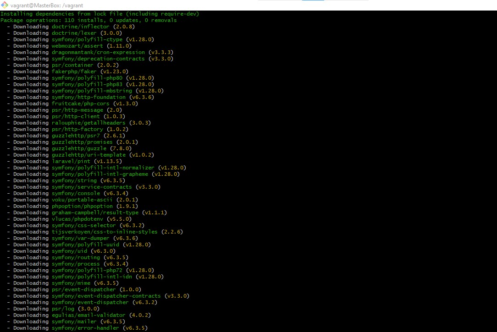
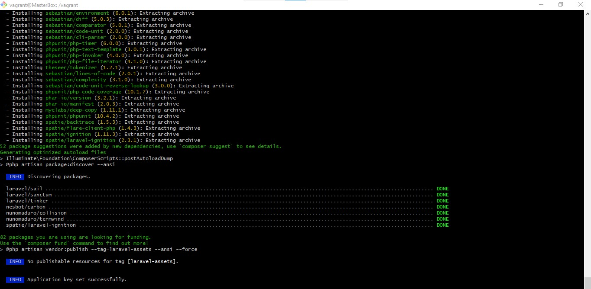
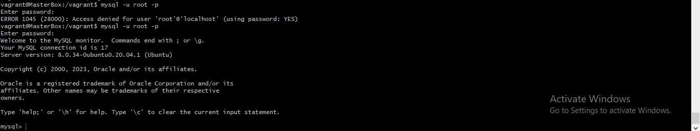

# TITLE: Automated Deployment of Laravel with PostgreSQL on Two Virtual Machines with GitHub Cloning and Cron Job Integration.

# Author: EMMANUEL KEZIAH

# Date Created: 21-Oct-2023
#========================================================================================================================================================================
# TABLE OF CONTENTS
# 1. Introduction
+ Purpose of Documentation
+ Prerequisites

# 2. Installation
+ Installing VirtualBox 
+ Installing Vagrant
+ Initializing Vagrant

# 3. Configurations
+ Defining virtual machines
+ Starting Virtual Machines

# 4. Provisioning Scripts
+ Provisioning Virtual Machine:
    + Deploying LAMPstack
        + Configuring Apache2 Web Server
            + Installing Apache2
            + Creating Laravel.conf file
            + Enabling Apache modules and laravel configuration file
        + Installing PHP and its modules
            + add-apt-repository ppa:ondrej/php
            + Modifying php.ini file 
            + Error handling and debugging
            
# 5. Git Cloning
+ Cloning GitHub Repository

# 6. Composer
+ Installing curl
+ Installing Composer
+ Creating a User
+ Setting Ownership and Permissions
+ Generating a Key for Laravel Application
+ Copying the .env file

# 7. MySQL Configurations
+ Configuring MySQL
    + Creating Database
    + Creating Database User
    + Caching configuration and migrating the database

# 8. Vagrant Commands
+ `vagrant up`
+ `vagrant halt`
+ `vagrant destroy`
+ `vagrant ssh`
+ `vagrant provision`

# 9. Conclusion
+ Summary
+ References


#========================================================================================================================================================================
# 1. IINTRODUCTION
## Purpose of Documentation:
    This documentation is intended to provide a step-by-step guide on how to deploy a Laravel application with PostgreSQL on two virtual machines using Vagrant. The documentation will also cover the installation of LAMPstack, Git, and Composer. The virtual machines will be provisioned with a bash script that will clone a GitHub repository and create a cron job to run the Laravel scheduler every minute. The documentation will also cover the configuration of the virtual machines, the installation of the required software, and the testing of the environment.

    ## Prerequisites:
    +  Vagrant
    +  VirtualBox
    +  Text Editor  (e.g. Visual Studio Code, Sublime Text, Atom, etc.)
    + Basic knowledge of Linux commands
    + Basic knowledge of Laravel
    + Basic knowledge of Git

# 2.INSTALLATION
## Installing VirtualBox:
    1. Download the latest version of VirtualBox from the official website: https://www.virtualbox.org/wiki/Downloads if you do not already have it installed on your machine.
    2. Run the installer and follow the instructions to install VirtualBox on your machine.

    ## Installing Vagrant:
    1. Download the latest version of Vagrant from the official website: https://www.vagrantup.com/downloads.html if you do not already have it installed on your machine.
    2. Run the installer and follow the instructions to install Vagrant on your machine.
    3. If you are using the terminal to install Vagrant, you can use the following commands:
        + `sudo apt-get update`:
        This will update the system.
        + `sudo apt-get install vagrant`
        This will install the latest version of Vagrant on your machine. 

## Initializing Vagrant:
    In order to initialize Vagrant, you will need to create a directory for your project. You can do this by using the following command:
        + `mkdir <directory_name>`: in this case, the directory name will be `Vagrant_Deployment`.

        + `cd <directory_name>`: this will change the directory to the newly created directory. You can use the `touch` command to create the necessary files in the directory and the `ls` command to list the files in the directory.

        + `vagrant init`: this will initialize Vagrant  and create a `Vagrantfile` in the directory. in this case, `./virtual_machines.sh` will be used to initialize Vagrant and create the `Vagrantfile` in the directory.

        + `vagrant up`: this will start the virtual machines and provision them with the bash script. in this case, `./virtual_machines.sh` will be used to start the virtual machines and provision them with the bash script for the master and slave virtual machines.
        The illustration below shows the commands used to initialize Vagrant and start the virtual machines:
         

         


# 3. CONFIGURATIONS
  ## Defining virtual machines:
    In order to define the virtual machines, you can either edit the vagrant file or create a bash script to define the virtual machines. In this case, a bash script will be used to define the virtual machines. The bash script will be named `virtual_machines.sh` and will be located in the `Vagrant_Deployment` directory. The bash script will contain the following code:

    ```
    #!/bin/bash
    cat <<EOF > Vagrantfile
    Vagrant.configure("2") do |config|
    config.vm.define "Slave" do |slave|
        slave.vm.box = "ubuntu/focal64"
            slave.vm.hostname = "SlaveBox"

            # Customize the amount of memory on the VM:
            slave.vm.provider "virtualbox" do |virtualbox|
            virtualbox.memory = "1024"
            virtualbox.cpus = "1"
            end
            # Other configuration(network, port forwarding, e.t.c) goes here...
            slave.vm.provision "shell", inline: <<-SHELL
            # Add scripts to update the system and install the required software here...
            SHELL
        end

        # Use the SHELL block to add shell commands to your Vagrantfile and close the shell block with a `SHELL`  and `end` statement.
        

        config.vm.define "Master" do |master|
            master.vm.box = "ubuntu/focal64"
            master.vm.hostname = "MasterBox"

            # Customize the amount of memory on the VM:
            master.vm.provider "virtualbox" do |virtualbox|
            virtualbox.memory = "1024"
            virtualbox.cpus = "1"
            end
            # Other configuration(network, port forwarding, etc.) goes here...
        end
        master.vm.provision "shell", inline: <<-SHELL
        # Add scripts to update the system and install the required software here...
       SHELL
    end
    EOF
    ```

# Explanation of the code:
    - The code above will define two virtual machines: `Master` and `Slave` . The script define the hostname, networking configurations, and the amount of memory allocated to the virtual machines. The script will also provision the virtual machines with a bash script that will install the required software and configure the virtual machines.

    - The shebang `#!/bin/bash` is used to specify the interpreter to be used to execute the script(it can be sh, bash or zsh). 

    - The `cat` command is used to concatenate the code in the `EOF` block and the `Vagrantfile` in the `Vagrant_Deployment` directory. The `Vagrantfile` will be created in the `Vagrant_Deployment` directory and will contain the code in the `EOF` block. 

    - The `EOF` block will contain the code to define the virtual machines.
    ```

# Starting Virtual Machines:
    The command `vagrant up` can also be added to the end of the bashscript or vagrantfile and this will automatically start the virtual machines and provision them with the bash script as seen below:
    ```
    #!/bin/bash
    cat <<EOF > Vagrantfile
    Vagrant.configure("2") do |config|
    config.vm.define "Slave" do |slave|
        # hostname and other configurations goes here...
        slave.vm.provision "shell", inline: <<-SHELL
            # Add scripts to update the system and install the required software here...
       SHELL
        end
        config.vm.define "Master" do |master|
            # Add similar scripts here...
       SHELL
    end
    EOF
    vagrant up
    ```

# 4. PROVISIONING SCRIPTS
## Provisioning Virtual Machine:
To run the script, you will need to navigate to the directory where the script is located and
run the command `vagrant ssh Master` or `vagrant ssh Slave` to access the virtual machines. Once you are in either virtual machines, navigate to the root directory using the `cd /` command, then navigate to the `vagrant` directory using the `cd vagrant` command. Once you are in the `vagrant` directory, you can run the script using the command `./<script_name>` e.g ./lampstack_Installation.sh

### Deploying LAMPstack:
The LAMP stack is a widely-used open-source software stack for web development, consisting of Linux, Apache, MySQL (or MariaDB), and PHP. Linux is the operating system, Apache is the web server software, MySQL (or MariaDB) is the database management system, and PHP is the scripting language. Together, these components provide a platform for building and running dynamic web applications. While LAMP was historically popular, other stacks like MEAN and MERN have gained popularity, especially in the context of JavaScript-based development. Some of the following commands will be used to deploy LAMPstack on both the master virtual machine:
+ `sudo apt-get update`: this will update the system. A condition will be added to check if the system is updated or not. If the system is not updated, the system will be updated and if the system is updated, the script will continue to the next command.

# Configuring Apache2 Web Server:
Apache2 is a web server that is used to serve web pages to clients. Apache2 can be configured to serve multiple websites on the same server. In this case, Apache2 will be configured to serve the Laravel application.
# Here are the steps to configure Apache2 web server:
+ Create a new configuration file for the application in the `/etc/apache2/sites-available` directory. The configuration file will be named `laravel.conf`. This can be done manually or using the following command in a script: `cat <<EOF > /etc/apache2/sites-available/laravel.conf`.
+ When the configuration file is created, you can use the following command to edit the configuration file: `sudo nano /etc/apache2/sites-available/laravel.conf`.
+ Add the necessary configurations to the configuration file. 

# Installing Apache2:
+ To install Apache2, you can use the following command in a script: `sudo apt-get install apache2`. The command will be executed in the `var/www/html` directory.

# Creating Laravel.conf file:
+ laravel.conf file is a file that contains the configuration settings for the Laravel application. The laravel.conf file will be created in the `/etc/apache2/sites-available` directory. The command used to create the laravel.conf file is: `cat <<EOF > /etc/apache2/sites-available/laravel.conf`.
+ When the laravel.conf file is created, you can use the following command to edit the laravel.conf file: `sudo nano /etc/apache2/sites-available/laravel.conf`.

# Enabling Apache modules and laravel configuration file:
+ The following commands will be used to enable the Apache modules and the laravel configuration file:
    + `sudo a2enmod rewrite`: this will enable the rewrite module.
    + `sudo a2ensite laravel.conf`: this will enable the laravel configuration file.
    + `sudo systemctl restart apache2`: this will restart the Apache2 service.

    Other options are also available and can be added to enable the Apache modules and the laravel configuration file:
    + `sudo a2enmod headers`: this will enable the headers module.
    + `sudo a2dissite 000-default.conf`: this will disable the default configuration file.
   
   # Installing PHP and its modules:
    PHP is a server-side scripting language that is used to create dynamic web pages. PHP can be used to create web applications, websites, and web services.
    
    # add-apt-repository ppa:ondrej/php:
    The command `sudo add-apt-repository ppa:ondrej/php` will be used to add the PPA repository for PHP. This repository provides the latest version of PHP and its modules that are not available in the default Ubuntu repositories.

    # Modifying php.ini file:
    php.ini file contains the configuration settings for PHP and can be modified to suit your needs. In this case, the php.ini file will be modified to change the `cgi.fix_pathinfo` directive to `0` and this will allow the server to process the PHP files without the need for a file extension. The command used to modify the php.ini file is: `sudo sed -i "s/;cgi.fix_pathinfo=1/cgi.fix_pathinfo=0/" /etc/php/7.4/apache2/php.ini`.After modifying the php.ini file, you can use the following command to restart the Apache2 service: `sudo systemctl restart apache2` to effect the changes.

    PHP can be installed using the following command: `sudo apt-get install php libapache2-mod-php php-mysql php-cli php-curl php-gd php-mbstring php-xml php-xmlrpc php-soap php-intl php-zip php-unzip php-tokenizer`. The command will be executed in the `var/www/html` directory. Conditional statements will be added to check if the packages are installed or not. If the packages are installed, the script will continue to the next command and if the packages are not installed, the script will display an error-handling message and it proceeds to install the packages.

    # Error handling and debugging:
    + If you encounter any errors while installing the software, you can use the following commands to fix the errors:
    + `sudo apt-get update`: this will update the system.
    + `sudo apt-get upgrade`: this will upgrade the system.
    + `sudo apt-get install -f`: this will fix any broken dependencies.

    # 5. GIT CLONING
    Git is a version control system that is used to track changes in files and coordinate work on those files among multiple people. Git can be used to clone a repository from GitHub and this can be done using the following command: `git clone <repository_url> <directory_name>`. Git cloning allows you to download the repository and create a copy of the repository in the specified directory. In this case, the conditional statement will ba added to check if the laravel directory exists or not. If the laravel directory exists, the script will continue to the next command and if the laravel directory does not exist, the script will clone the repository and create a copy of the repository in the laravel directory. In this case,
    the repository URL will be `https://github.com/laravel/laravel.git`.`

    # 6. COMPOSER
    Composer is a dependency manager for PHP and can be used to install packages and manage dependencies. 
    To install Composer, you need to install curl and then use curl to download the Composer installer.  Curl  is a command-line tool that is used to transfer data to or from a server using various protocols like: HTTP, HTTPS, FTP, etc.

    # Installing curl:
    To install curl, you can use the following command in a script: `sudo apt-get install curl`. The command will be executed in the `var/www/html` directory.

    # Installing Composer:
    To install Composer, you can use the following command in a script: `curl -sS https://getcomposer.org/installer | sudo php -- --install-dir=/usr/local/bin --filename=composer`. This command allows you to download the Composer installer and install Composer on your machine. The command will be executed in the `var/www/html` directory.

    # Creating a User:
    To create a user, you can use the following command in a script: `sudo adduser <username>`. Creating this user will allow you to run Composer commands without using the root user. The command will be executed in the `var/www/html` directory.

    # Setting Ownership and Permissions:
    To set ownership and permissions, you can use the following command in a script: `sudo chown -R <username>:<username> /var/www/html/laravel`. This command will set the ownership and permissions for the Laravel application. In this case, you will need to set the permissions for the Laravel application to allow the user to run Composer commands. Some of the permissions that will be set are: `755` for storage and bootstrap directories. The command will be executed in the `var/www/html` directory.

    # Generating a Key for Laravel Application:
    Laravel application is configured to use the `APP_KEY` environment variable to encrypt user sessions and other sensitive data. The command `sudo -u altcomposer bash -c 'cd /var/www/html/laravel && composer install && php artisan key:generate` is used to download the Laravel dependencies and generate the application key.
    `sudo` allows the command run with superuser privileges, `-u altcomposer` runs the command as the altcomposer user, `bash -c` executes the following command in a new shell, and `cd /var/www/html/laravel && composer install && php artisan key:generate` changes to the /var/www/html/laravel directory, installs the Laravel dependencies using Composer, and generates the application key using the php artisan key:generate command. The application key is used for encryption and decryption of user sessions and other sensitive data.
    The screenshot below shows the download of the Laravel dependencies and the generation of the application key:
    

    

    # Copying the .env file:
    The .env file contains the configuration settings for the Laravel application. To copy the .env file, you can use the following command in a script: `cp .env.example .env`. The command will be executed in the `var/www/html/laravel` directory.

# 7. MySQL CONFIGURATIONS
    MySQL is a relational database management system that is used to store data in tables. MySQL can be used to create databases, tables, and users. MySQL can also be used to grant privileges to users and revoke privileges from users. In this case, MySQL will be used to create a database, create a user, grant privileges to the user, and revoke privileges from the user.

  # Configuring MySQL:
    To configure MySQL, you can use the following command in a script: `sudo mysql_secure_installation`. This command will allow you to configure MySQL and set the root password for MySQL. The command will be executed in the `var/www/html` directory.

  # Creating Database:
    To create a database, you can use the following command in a script: `sudo mysql -u root -p -e "CREATE DATABASE <database_name>"`. This command will allow you to create a database in MySQL. The command will be executed in the `var/www/html` directory.

   # Creating Database User:
    To create a database user, you can use the following command in a script: `sudo mysql -u root -p -e "CREATE USER '<username>'@'localhost' IDENTIFIED BY '<password>'"`. This command will allow you to create a database user in MySQL. The command will be executed in the `var/www/html` directory.

   # Caching configuration and Migrating the Database
   `php artisan config:cache`: This command will cache the configuration settings for the Laravel application. It is important to note that this command will only work if the .env file is present in the root directory of the Laravel application.
    `php artisan migrate`: This command will migrate the database from the Laravel application to the MySQL database. It is important to note that this command will only work if the .env file is present in the root directory of the Laravel application.
    The screenshot below shows the configuration of mysql:
    

  # Restarting Apache
  This can be done using: `systemctl restart apache2`. This ensures that all the configurations and changes made in the script are properly executed.


  # 8. VAGRANT COMMANDS
  Some of the commands that will be used to manage the virtual machines are:
   + `vagrant up`: This command will start the virtual machines, read the Vagrantfile in the current directory and create a new virtual machine based on the configuration specified in the file.

    + `vagrant halt`: This command will suspend or stop the virtual machines and saves its current state.

    + `vagrant destroy`: This command will delete/remove all traces of the virtual machine from the system, including any disks that were created for it and any network interfaces that were attached to it. 

    + `vagrant ssh`: This command will connect to a running virtual machine via SSH. This command opens an SSH connection to the virtual machine and allows you to execute commands on it as if you were logged in directly.

    + `vagrant provision`: This command will run the provisioning scripts for a virtual machine. This command applies any changes to the virtual machine that are specified in the provisioning scripts.

   # 9. CONCLUSION
    ## Summary:
    This documentation has provided a step-by-step guide on how to deploy a Laravel application with PostgreSQL on two virtual machines using Vagrant. The documentation has also covered the installation of LAMPstack, Git, and Composer. The virtual machines were provisioned with a bash script that cloned a GitHub repository and created a cron job to run the Laravel scheduler every minute. The documentation also covered the configuration of the virtual machines, the installation of the required software, and the testing of the environment.

    ## References:
    
    + https://www.virtualbox.org/wiki/Downloads
    
    + https://medium.com/@melihovv/zero-time-deploy-of-laravel-project-with-ansible-3235816676bb

    +  https://www.cherryservers.com/blog/ how-to-install-and-setup-postgresql-server-on-ubuntu-20-04

    + https://dev.to/sureshramani/how-to-deploy-laravel-project-with-apache-on-ubuntu-36p3
