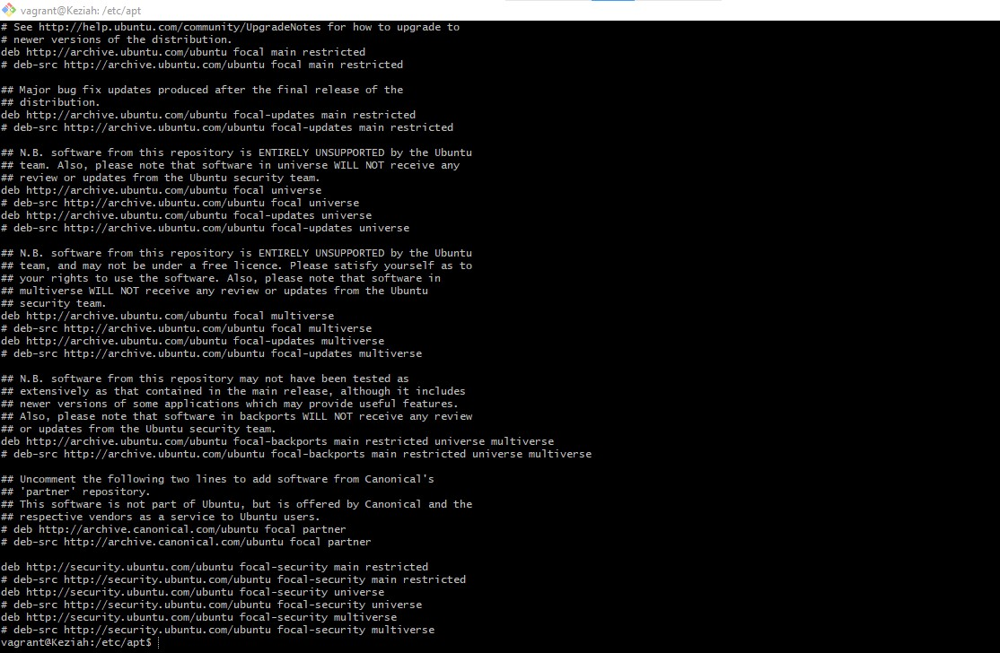

## Task:
Install PHP 7.4 on your local linux machine using the "ppa:ondrej/php" package repo.

## Instruction:
Learn how to use the add-apt-repository command
Submit the content of /etc/apt/sources.list and the output of php -v command.

## Solutions:

# Description:
This task involves installing PHP 7.4 on a local linux machine using the "ppa:ondrej/php" package repo. The screenhots contents of the /etc/apt/sources.list and the output of php -v command are embedded in this markdown file.

# Installing PHP 7.4 on a local linux machine using the "ppa:ondrej/php" package repo:
The `sudo add-apt-repository ppa:ondrej/php` command will add the "ppa:ondrej/php" package repo to the local linux machine. The screenshot below shows the output of the `sudo add-apt-repository ppa:ondrej/php` command.

**

# Using the `add-apt-repository` command:
The `add-apt-repository` command is used to add a repository to the /etc/apt/sources.list file. The screenshot below shows the contents of the /etc/apt/sources.list file.

**

# `php -v` command:
The `php -v` command is used to display the version of PHP installed on the local linux machine. The screenshot below shows the output of the `php -v` command.

**

