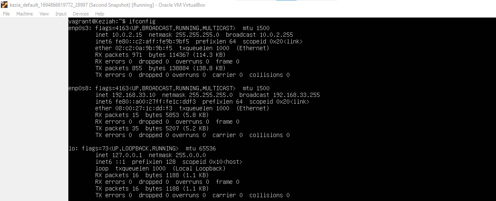

## Task: Set up Ubuntu 20.04 LTS on your local machine using vagrant.
## Instruction:
- Customize your vagrantfile as necessary with the private_network set to dhcp
- Once the machine is up, run ifconfig and share the output in your submission along with your vagrantfile in a folder for this exercise.

## Description:
The provided solution is a Vagrantfile that can be used to set up an Ubuntu 20.04 LTS virtual machine on a local machine using Vagrant. The Vagrantfile has been customized as per the instructions, with the "private_network" set to "dhcp".
The solution also includes screenshots of the login process for the Vagrant virtual machine and the output of the ifconfig command. The screenshots have been embedded in the solution using Markdown.

## Solution:
# Login process for the Vagrant virtual machine:

*Screenshot of the login process for the vagrant virtual machine*

# Output of the ifconfig command:

*Screenshot of the output of the ifconfig command*

# Contents of the Vagrantfile:
- The vagrantfile is customized as per the instructions:
# -*- mode: ruby -*-
# vi: set ft=ruby :

# All Vagrant configuration is done below. The "2" in Vagrant.configure
# configures the configuration version (we support older styles for
# backwards compatibility). Please don't change it unless you know what
# you're doing.
Vagrant.configure("2") do |config|
  # The most common configuration options are documented and commented below.
  # For a complete reference, please see the online documentation at
  # https://docs.vagrantup.com.

  # Every Vagrant development environment requires a box. You can search for
  # boxes at https://vagrantcloud.com/search.
  config.vm.box = "ubuntu/focal64"

  # Disable automatic box update checking. If you disable this, then
  # boxes will only be checked for updates when the user runs
  # `vagrant box outdated`. This is not recommended.
  # config.vm.box_check_update = false

  # Create a forwarded port mapping which allows access to a specific port
  # within the machine from a port on the host machine. In the example below,
  # accessing "localhost:8080" will access port 80 on the guest machine.
  # NOTE: This will enable public access to the opened port
   config.vm.network "forwarded_port", guest: 80, host: 8080
   config.vm.network "forwarded_port", guest: 22, host: 2222

  # Create a forwarded port mapping which allows access to a specific port
  # within the machine from a port on the host machine and only allow access
  # via 127.0.0.1 to disable public access
  # config.vm.network "forwarded_port", guest: 80, host: 8080, host_ip: "127.0.0.1"

  # Create a private network, which allows host-only access to the machine
  # using a specific IP.
  config.vm.network "private_network",  type: "dhcp"

  # Create a public network, which generally matched to bridged network.
  # Bridged networks make the machine appear as another physical device on
  # your network.
  # config.vm.network "public_network"

  # Share an additional folder to the guest VM. The first argument is
  # the path on the host to the actual folder. The second argument is
  # the path on the guest to mount the folder. And the optional third
  # argument is a set of non-required options.
  # config.vm.synced_folder "../data", "/vagrant_data"

  # Disable the default share of the current code directory. Doing this
  # provides improved isolation between the vagrant box and your host
  # by making sure your Vagrantfile isn't accessable to the vagrant box.
  # If you use this you may want to enable additional shared subfolders as
  # shown above.
  # config.vm.synced_folder ".", "/vagrant", disabled: true

  # Provider-specific configuration so you can fine-tune various
  # backing providers for Vagrant. These expose provider-specific options.
  # Example for VirtualBox:
  #
  # config.vm.provider "virtualbox" do |vb|
  #   # Display the VirtualBox GUI when booting the machine
  #   vb.gui = true
  #
  #   # Customize the amount of memory on the VM:
  #   vb.memory = "1024"
  # end
  #
  # View the documentation for the provider you are using for more
  # information on available options.

  # Enable provisioning with a shell script. Additional provisioners such as
  # Ansible, Chef, Docker, Puppet and Salt are also available. Please see the
  # documentation for more information about their specific syntax and use.
  # config.vm.provision "shell", inline: <<-SHELL
  #   apt-get update
  #   apt-get install -y apache2
  # SHELL
end

## Summary:
The Vagrantfile includes configuration options for the virtual machine, such as the box to use (ubuntu/focal64), forwarded port mappings, and network settings. The Vagrantfile also includes commented-out sections for provider-specific configuration and provisioning with shell scripts.
