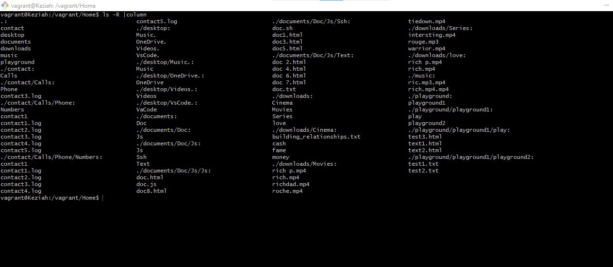

## Task 2: 
Research online for 10 more linux commands aside the ones already mentioned in this module. Submit your altschool_cloud_exercises project explaining what each command is used for with examples of how to use each command and example screenshots using them.
## Instruction: 
Submit your work in a folder for this exercise in your 'altschool_cloud_exercises_project' folder. Use markdown files to embed images.

## Description:
The solution provided is a list of 10 Linux commands with descriptions, examples of how to use each command, and example screenshots using them. The commands include `ls -R | column`, `$command -h OR $command --help`, `free`, `last`, `cal`, `env`, `cat command and the > operator`, `history | grep sudo`, `apt-get`, and `sudo su`. The screenshots are embedded in markdown files.

## Solutions:
# "ls -R | column" command:
The `ls -R | column` command is a Linux command that is used to list the contents of a directory and its subdirectories recursively, and display the output in columns. When used with a directory path, the `ls -R` command will display the names of all files and directories in the directory and its subdirectories, and the column command will format the output into columns for easier readability.
In the example below, the `ls -R` command is used to display the contents of all files and directories in the /home/vagrant/ directory and output the contents in colums.

**

# "$command -h" OR "$command --help" e.g "sudo -h" command:
The `$command -h` OR `$command --help` command is a Linux command that is used to display a help message for the specified command. When used with a command, the `-h` or `--help` option will display a help message for the command, including a list of all the options that can be used with the command.
In the example below, the `sudo -h` command is used to display the number of options that can be used with the sudo command.

**

# "free" command:
The `free` command is a Linux command that is used to display information about the system's memory usage, including the total amount of memory, the amount of memory used, and the amount of memory free.
The `free -h` command is used to display the memory usage in human-readable format, with the memory sizes displayed in units of "B", "KB", "MB", "GB", or "TB" depending on the size of the memory.
The `free -m` command is used to display the memory usage in megabytes, with the memory sizes displayed in units of "MB".
The `free -g` command is used to display the memory usage in gigabytes, with the memory sizes displayed in units of "GB".
In the example below, the memory usage is displayed in units of "MB","GB" using the `free -m`  and `free -h` commands.

**

# "last" command:
The `last` command is a Linux command that is used to display information about the last logged in users. When used without any options, the `last` command will display the last logged in users, including the username, the terminal used, the date and time of login, and the IP address of the user.
In the example below, the `last` command is used to display the last logged in users along with their details.
**

# "cal" command:
The `cal` command is a Linux command that is used to display a calendar for the current month. When used without any options, the `cal` command will display a calendar for the current month, including the days of the week and the dates of the month.
When used with the `-y` option, the `cal` command will display a calendar for the current year, including the days of the week and the dates of the month.

**

# "env" command:
The `env` command is a Linux command that is used to display the environment variables that are currently set. When used without any options, the `env` command will display the environment variables that are currently set, including the variable name and its value.
In the example below, the `env` command is used to display the environment variables that are currently set on the linux system.

**

# "cat" command and the ">" operator:
The `cat` command is a Linux command that is used to display the contents of a file. When used without any options, the `cat` command will display the contents of a file, including the contents of the file and the line numbers.
In the example below, the `cat` command is used to display the contents of "file.txt" and "file.html" while the `>` operator is used to redirect or copy the contents of "file.txt" to "file.html" thereby making "file.html" a copy of "file.txt".

**

# "history | grep sudo" command:
The `history` command is used to display the command history of the current shell session. The `grep` command is used to search for a specific pattern in the output of a command. By piping the output of the history command to the grep command with the pattern `sudo`, the `history | grep sudo command` is used to search the command history for all commands that contain the word `sudo`.

**

# "apt-get" command:
The `apt-get` command is a Linux command that is used to install, remove, and update packages on a Debian-based system. When used with the `install` option, the `apt-get` command will install the specified package. When used with the `remove` option, the `apt-get` command will remove the specified package. When used with the `update` option, the `apt-get` command will update the package list.
In the example below, the `apt-get install` command used along with the `sudo` command is used to install the `tree` package.

**

# "sudo su" command:
The `sudo su` command is a Linux command that is used to switch to the root user account, allowing the user to perform administrative tasks that require root privileges. The `sudo` command is used to execute a command with elevated privileges, while the `su` command is used to switch to another user account.
In the example below, when the `apt-get install` command is used without the `sudo` command, an error message is displayed, prompting the user to use the `sudo` command to execute the command with elevated privileges. When the `sudo apt-get install` command is used, the `tree` package is installed successfully.

**