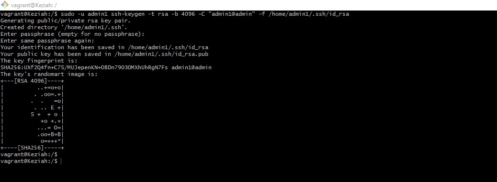

## Exercise:
Create 3 groups – Admin, support & Engineering and add the admin group to sudoers. 
Create a user in each of the groups. 
Generate SSH keys for the user in the admin group.

## Instruction:
Submit the contents of /etc/passwd, /etc/group, /etc/sudoers

## Solutions:
# Description: 
This task involves creating three groups named "Admin", "Support", and "Engineering", adding the "admin" group to the sudoers file, creating a user in each of the three groups, and generating SSH keys for the user in the "admin" group. The screenhots contents of the /etc/passwd, /etc/group, and /etc/sudoers  are embedded in this markdown file.

# Creating Groups- Admin, Support & Engineering;
The `sudo groupadd` command will create a group. In the screenshot below, three groups are created using the `sudo groupadd` command. The groups are named "Admin", "Support", and "Engineering" and have a group id of 1005, 1006 and 1007 respectively. The contents of the `/etc/group` file are displayed using the `cat /etc/group` command.

**

# Adding the admin group to sudoers;
The `sudo visudo` command will open the sudoers file in the nano editor. The screenshot below shows the contents of the sudoers file.

**

# Creating users in each of the groups;
The `sudo useradd -m -s /bin/bash -g <groupname> <username>` command creates users with the specified username and adds them to the specified group. The screenshot below shows the contents of the /etc/passwd and the three users .

**

# Generating SSH keys for the user in the admin group;
The `ssh-keygen` command is used to generate SSH keys. The screenshot below shows the SSH keys generated for the user in the admin group.

# Generating ssh keys for the user `admin1` in the `Admin` group;

**

# Confirm ssh key generation:
Use the `ls` command in the `/home/admin1/.ssh` directory to confirm if the ssh key has been generated for the user in the admin group (superuser priviledges is required to access it). If the ssh key(public and private) has been generated, they will be located in the files named "id_rsa" and "id_rsa.pub" as displayed in the screenshot below:

**

