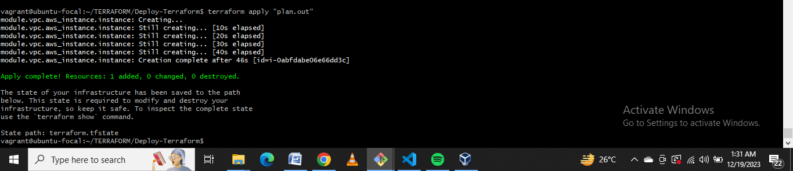

# TITLE: Multi-Region AWS Instance Provisioning with Terraform.

# DESCRIPTION: This document provides a step-by-step guide on how to provision multi-region AWS instances using Terraform. It also includes instructions on installing and configuring ansible, docker, Terraform, and AWSCLI on a Windows 10 machine. It also contains screenshots where necessary.

# AUTHOR: Emmanuel Keziah

# Date Created: 19-Dec-2023

# =================================================================================================================================================================
# TABLE OF CONTENTS
# 1. Introduction
+ Purpose of Documentation
+ Prerequisites
    + Installing VirtualBox
    + Installing Vagrant
    + Downloading ubuntu ISO 

# 2. Creating directories
+ TERRAFORM
        + Deploy-Terraform
    + modules
        + vpc
    + Screenshots

# 3. Creating files
   + Deploy-Terraform Files
        + Development.tfvars
        + main.tf
        + Production.tfvars
        + variables.tf

    + modules\vpc Files
        + ansible_docker.tf
        + outputs.tf
        + security_group.tf
        + Terraform_Documentation.md

# 4. Installations
+ Installing Terraform 
    + Using GUI
    + Using CLI
        - sudo apt update
        - sudo apt install terraform
        OR
        - curl -O https://releases.hashicorp.com/terraform/0.15.5/terraform_0.15.5_windows_amd64.zip

        - unzip terraform_0.15.5_windows_amd64.zip

+ Installing AWSCLI

# 5. Configurations
+ Configuring AWSCLI
    + aws --version
    + aws configure
    + Creating Access keys
    + Creating Secret keys

+ Initializing Terraform
    + terraform --version
    + terraform init
+ Running the "Development.tfvars" file with configuration parameters
+ Running the "Production.tfvars" file with configuration parameters
+ Running the "Staging.tfvars" file with configuration parameters

# 6. Commands
+ `vagrant up`
+ `vagrant ssh`
+ `aws configure`
+ `terraform init`
+ `sudo apt update`
+ `sudo apt install awscli`
+ `terraform plan -var-file=Development.tfvars`
+ `terraform plan -var-file=Production.tfvars`
+ `terraform apply -var-file=Development.tfvars`
+ `terraform apply -var-file=Production.tfvars`
+ `terraform destroy -var-file=Development.tfvars`
+ `terraform destroy -var-file=Production.tfvars`

# 7. Troubleshooting
+ Common Errors
+ Debugging

# 8. Conclusion
+ Summary
+ References

# =================================================================================================================================================================

# 1. Introduction
## Purpose of Documentation:
This documentation is to provide a step-by-step guide on how to provision  multi-region AWS instances using Terraform. This documentation will also provide a guide on how to  install and configure ansible, docker, Terraform and AWSCLI on a Windows 10 machine.

## Prerequisites:
+ *Text Editor* (Visual Studio Code, Atom e.t.c): Text editors can be used to write and execute commands. Visual studio code is one of the commonly used text editors, git bash can also be used. Download and install the text editor if you haven't already done so.

+ *Installing VirtualBox:*
    VirtualBox: VirtualBox is a container for running virtual machines on your computer.  It allows you to run multiple guest operating systems on your computer without having to change your host operating system.
    To download and install VirtualBox, visit https://www.virtualbox.org/wiki/Downloads or run the following commands on the terminal(command-line interface):
    + `sudo apt update`: This command updates the package list to ensure you get the latest version and dependencies for VirtualBox.
    + `sudo apt install virtualbox`: This command installs VirtualBox on your Ubuntu machine. `apt` is used for ubuntu/debian-based systems while `yum` is used for redhat/centos-based systems.
    
+ *Installing Vagrant:*
    Vagrant:  Vagrant is required to configure the virtual machine that will be used to run the Terraform scripts, install ansible, docker, Terraform and AWSCLI on the virtual machine. To download and install vagrant, visit https://www.vagrantup.com/downloads or run the following commands on the terminal(command-line interface):
    + `sudo apt update`: This command updates the package list to ensure you get the latest version and dependencies for Vagrant.
    + `sudo apt install vagrant`: This command installs Vagrant on your Ubuntu machine.

+ *Downloading ubuntu ISO:*
    Ubuntu ISO: This is the operating system that will be installed on the virtual machine. To download the ubuntu ISO, visit https://ubuntu.com/download/desktop or run the following commands on the terminal(command-line interface):
    + `sudo apt update`: This command updates the package list to ensure you get the latest version and dependencies for Ubuntu ISO.
    + `sudo apt install ubuntu`: This command installs Ubuntu ISO on your Ubuntu machine.

+ *AWS Account:* 
    AWS is a service provider that provides access to cloud computing services. To create an AWS account, visit https://aws.amazon.com/ and follow the instructions on the AWS account creation page.

+ Basic knowledge of Linux commands

+ Basic knowledge of Terraform

+ Basic knowledge of AWS services

# =================================================================================================================================================================

# 2. Creating directories
The following directories will be created:
+ *TERRAFORM:*
    Create  the main parent directory called "TERRAFORM" that will contain all the Terraform scripts that will be used to provision the AWS instances. 

+ *Deploy-Terraform:*
    In the "TERRAFORM" folder, create another directory called "Deploy-Terraform". This directory will contain all the ".tfvars" files that will be used to configure and deploy the AWS instances in their respective regions.

+ *modules\vpc:*
    Also create another directory called "modules" folder. Navigate into the "modules" folder and create a new directory named "vpc". The "vpc" directory will house all the reusable terraform scripts that will be used to install ansible, docker, etc.
    
+ *Screenshots:*
    Create the screenshots directory to store images providing more information. This gives a better understanding of the terraform scripts. This is optional.

## 3. Creating Files
# Deploy-Terraform Files
+ *Development.tfvars:*
    In the "Deploy-Terraform" directory, create a file named "Development.tfvars". This file will contain variables that will be used to set environment-specific values for the AWS instances that will be deployed in the development environment. The variables in this file will be used to configure the AWS instances in the development environment. Simply put, the Development.tfvars contains defines variables/parameters for configuring the development environment, including the region, project name, VPC CIDR block, subnet CIDR blocks, AMI, instance type, and key pair. These variables can be used in Terraform to provision infrastructure resources.

+ *Production.tfvars:*
    In the "Deploy-Terraform" directory, create another file named "Production.tfvars". This file will contain variables that will be used to set environment-specific values for the AWS instances that will be deployed in the production environment. It is similar to the variables created in the "Development.tfvars", the differences is in the following variables: region, project name, keypair and ami id.
    All the variables specified in this file will determine how the "production" environment will look like.

+ *main.tf:*
    In the same directory, create another file named "main.tf".
    This Terraform script sets up the necessary infrastructure components such as VPC, subnets, and an EC2 instance in AWS. It uses a module called "vpc" to configure and deploy the VPC with the specified parameters.

+ *variables.tf:*
Also create another file called "variables.tf". The script in this file defines all the variables that can be used to configure a VPC (Virtual Private Cloud) module in AWS (Amazon Web Services). The variables include the region, project name, VPC CIDR block, subnet CIDR blocks, AMI (Amazon Machine Image), instance type, and key pair. These variables allow for easy customization and reusability of the VPC module by providing flexibility in defining different configurations for different environments or projects.
i.e it can be used to configure both the "Development" and "Production" environments.

# modules\vpc Files
+ *ansible_docker.tf:*
This script defines an AWS EC2 instance resource block and configures these resources with the specified AMI, instance type, key pair, subnet, security group, and availability zone. The user data section contains a bash script that updates the instance, installs Docker, starts and enables the Docker service, pulls the latest Ansible Docker image, and runs it in a detacheable mode with a volume mount for Ansible playbooks. Finally, the instance is tagged with a name and source using variables defined in the script.

+ *outputs.tf:*
The output.tf script is a terraform script, Its purpose is to configure and provision resources in a cloud environment. The script defines several output variables that provide information about the resources being configured. These outputs include the region name, project name, VPC ID, public IP address of an instance, subnet IDs, and an internet gateway. The values of these outputs are obtained from the corresponding resources defined elsewhere in the script, such as the VPC, subnets, and instance. When the script is executed, Terraform will create or update the specified resources and display the values of these outputs for reference or further use.

+ *security_group.tf:*
This script defines an AWS security group resource block and configures these resources with the specified ingress and egress rules. The ingress rules allow SSH access from the specified IP address and HTTP access from anywhere. The egress rules allow all outbound traffic. The security group is tagged with a name and source using variables defined in the script.

+ *Terraform_Documentation.md*:
This file contains the documentation for the Terraform scripts. It provides a step-by-step guide on how to provision multi-region AWS instances using Terraform. It also provides a guide on how to install and configure ansible, docker, Terraform and AWSCLI on a Windows 10 machine.

# =================================================================================================================================================================
# 4. Installations
+ *Installing Terraform:*
    Terraform: Terraform is an open-source infrastructure as code software tool created by HashiCorp. It enables users to define and provision a datacenter infrastructure using a high-level configuration language known as Hashicorp Configuration Language (HCL), or optionally JSON. 
    
    + *Installing Terraform using GUI:*
    To download and install Terraform, visit https://www.terraform.io/downloads.html  and follow the instructions on the Terraform download page.

    + *Installing Terraform using CLI:*
      To install Terraform using CLI, run the following commands on the terminal (command-line interface):   
        + `sudo apt update`: This command updates the package list to ensure you get the latest version and dependencies for Terraform.
        + `sudo apt install terraform`: This command installs Terraform on your Ubuntu machine from the default repoaitories available. Though, the version of Terraform available in the default repositories may not be the latest.

        *Note*: The `apt` command will only work if you're using Linux distributions like Ubuntu or Debian that uses APT for package management.

        To install "version-specific" Terraform, input the following commands in your terminal
        - `curl -O https://releases.hashicorp.com/terraform/0.15.5/terraform_0.15.5_windows_amd64.zip`: This command uses `curl` to download a specific version of Terraform for the 64-bit window version, and the `-O` option allows the downloaed file to be saved with the same name as the url. In this case, it is saved as "terraform_0.15.5_windows_amd64.zip". Also, replace the version number (0.15.5) with the latest or most preferred version if necessary.

        - `unzip terraform_0.15.5_windows_amd64.zip`: This command extracts the contents of the terraform zip file that was downloaded using the `curl` command. Once the file is unzipped.

        - After running the `unzip terraform....` command, you an move the terraform executable file to a directory on your system's PATH using the `mv terraform /usr/local/bin` command.

        - To verify the installation, run the `terraform version` command. The installation is successful if it dsplays the version of Terraform that you installed.

+ *Installing AWSCLI:*
    AWSCLI: AWS Command Line Interface (AWS CLI) is an open source tool that enables you to interact with AWS services using commands in your command-line shell. That is, it allows you to control multiple AWS services from the command line and automate them through scripts. 

    To download and install AWSCLI, visit https://docs.aws.amazon.com/cli/latest/userguide/install-cliv2-linux.html and follow the instructions on the AWSCLI download page
    or run the following commands on the terminal(command-line interface):
    + `sudo apt update`: This command updates the package list to ensure you get the latest version and dependencies for AWSCLI.

    + `sudo apt install awscli`: This command installs AWSCLI on your Ubuntu machine.

# =================================================================================================================================================================

# 5. Configurations
+ *Configuring AWSCLI:*
  After installing AWSCLI, it needs to be configured to enable it to interact with AWS services. To configure AWSCLI, run the following commands on the terminal:
    + `aws --version`: This command displays the version of AWSCLI that is installed on your machine.

    + `aws configure`: This command configures AWSCLI on your machine. It prompts you to input your AWS Access Key ID, AWS Secret Access Key, Default region name and Default output format. These details can be obtained from your AWS account. 
    To get your AWS Access Key ID and AWS Secret Access Key, visit https://docs.aws.amazon.com/cli/latest/userguide/cli-configure-quickstart.html#cli-configure-quickstart-creds and follow the instructions on the page. 
    To get your Default region name and Default output format, visit https://docs.aws.amazon.com/cli/latest/userguide/cli-configure-quickstart.html#cli-configure-quickstart-region and follow the instructions on the page.

+ *Initializing Terraform:*
    After installing aws-cli and configuring it to use AWS services, the next step is to initialize Terraform so that it can be used to configure the service provider (AWS) and provision the AWS instances.
    To initialize Terraform, run the following commands on the terminal:
    + `terraform --version`: This command displays the version of Terraform that is installed on your machine.

    + `terraform init`: This command initializes Terraform on your machine. It downloads the provider and initializes it with the values specified in the configuration files. It also downloads the modules and initializes them with the values specified in the configuration files.

+ Running the "Development.tfvars" file with configuration parameters:
    To run the "Development.tfvars" file with configuration parameters, run the following commands on the terminal:
     + `terraform plan -var-file=Development.tfvars`: This command displays the execution plan for the "Development.tfvars" file. It displays the changes that will be made to the AWS instances in the development environment. It also displays the resources that will be created, modified or deleted. Once you're satisfied with the changes, you can proceed to the next step.

     + `terraform apply -var-file=Development.tfvars`: This command applies the changes specified in the "Development.tfvars" file. It creates the AWS instances in the development environment.

+ Running the "Production.tfvars" file with configuration parameters:
    To run the "Production.tfvars" file with configuration parameters, run the following commands on the terminal:
     + `terraform plan -var-file=Production.tfvars`: This command displays the execution plan for the "Production.tfvars" file. It displays the changes that will be made to the AWS instances in the production environment. It also displays the resources that will be created, modified or deleted. Once you're satisfied with the changes, you can proceed to the next step.

     + `terraform apply -var-file=Production.tfvars`: This command applies the changes specified in the "Production.tfvars" file. It creates the AWS instances in the production environment.

+ Running the "Staging.tfvars" file with configuration parameters:
     To run the "Staging.tfvars" file with configuration parameters, run the following commands on the terminal:
     + `terraform plan -var-file=Staging.tfvars`: This command displays the execution plan for the "Staging.tfvars" file. It displays the changes that will be made to the AWS instances in the staging environment. It also displays the resources that will be created, modified or deleted. Once you're satisfied with the changes, you can proceed to the next step.

     + `terraform apply -var-file=Staging.tfvars`: This command applies the changes specified in the "Staging.tfvars" file. It creates the AWS instances in the staging environment.

# =================================================================================================================================================================
# 6. Commands
 Below is  a list of some of the commands that can be used to provision the AWS instances from your terminal:
 
  + `vagrant up`: This command is used to create and configure the virtual machine. It is used to provision the virtual machine that will be used to run the Terraform scripts, install ansible, docker, Terraform and AWSCLI on the virtual machine.

  + `vagrant ssh`: This command is used to access the virtual machine. It is used to access the virtual machine that will be used to run the Terraform scripts, install ansible, docker, Terraform and AWSCLI on the virtual machine.

    + `aws configure`: This command is used to configure AWSCLI on your machine. It prompts you to input your AWS Access Key ID, AWS Secret Access Key, Default region name and Default output format. These details can be obtained from your AWS account. 
    To get your AWS Access Key ID and AWS Secret Access Key, visit https://docs.aws.amazon.com/cli/latest/userguide/cli-configure-quickstart.html#cli-configure-quickstart-creds and follow the instructions on the page. 
    To get your Default region name and Default output format, visit https://docs.aws.amazon.com/cli/latest/userguide/cli-configure-quickstart.html#cli-configure-quickstart-region and follow the instructions on the page.

    + `terraform init`: This command initializes Terraform on your machine. It downloads the provider and initializes it with the values specified in the configuration files. It also downloads the modules and initializes them with the values specified in the configuration files.
      

    + `sudo apt update`: This command updates the package list to ensure you get the latest version and dependencies for Terraform.

    + `sudo apt install awscli`: This command installs AWSCLI on your Ubuntu machine.

    + `terraform plan -var-file=Development.tf`: This command displays the execution plan for the "Development.tfvars" file. It displays the changes that will be made to the AWS instances in the development environment. It also displays the resources that will be created, modified or deleted. Once you're satisfied with the changes, you can proceed to the next step.
     

    + `terraform plan -var-file=Production.tfvars`: This command displays the execution plan for the "Production.tfvars" file. It displays the changes that will be made to the AWS instances in the production environment. It also displays the resources that will be created, modified or deleted. Once you're satisfied with the changes, you can proceed to the next step.
     

    + `terraform apply -var-file=Development.tfvars`: This command applies the changes specified in the "Development.tfvars" file. It creates the AWS instances in the development environment.
    
    

    *Note*: Replace "Development.tfvars" with "Production.tfvars" or "Staging.tfvars" to provision the AWS instances in the production or staging environment respectively.

    After executing the terraform scripts, you can view the AWS instances in your AWS account to verify that they have been provisioned successfully. 
    
    
    
    
    + If you are ready to terminate the AWS instances, run the following commands on the terminal:

    + `terraform destroy -var-file=Development.tfvars`: This command destroys the AWS instances in the development environment. 
     
    
    Ensure that you also run `terraform destroy -var-file=Production.tfvars` and `terraform destroy -var-file=Staging.tfvars` to destroy the AWS instances in the production and staging environments respectively.

# =================================================================================================================================================================
# 7. Troubleshooting
+ *Common Errors:*
    + *Granting unrestricted access to the private keys:*
    Your private keys should not be accessible to anyone. To avoid this, you can change the permissions of the private keys to restrict access to the keys. To do this, run the following command on the terminal: `chmod 400 <path to private key>`. This will change the permissions of the private key to restrict access to the key.
    
    + *Using wrong ssh key format:*
    The ssh key format used in the Terraform script should be the same as the format of the ssh key that was generated. To avoid this error, ensure that the ssh key format used in the Terraform script is the same as the format of the ssh key that was generated.
    AWS expects that the ssh key format should be in the OpenSSH format. In this case, the `ssh-keygen` was used to redirect the output of the SSH key generation process to the `key.pub` file. This file contains the public key in the OpenSSH format to make it compatible with AWS.
    To view the contents of the `key.pub` file, run the following command on the terminal: `cat key.pub`. 
    

    + Error: "Error: Error launching source instance: Unsupported: Your requested instance type (t2.micro) is not supported in your requested Availability Zone (us-east-1a). Please retry your request by not specifying an Availability Zone or choosing us-east-1b, us-east-1c, us-east-1d, us-east-1e, us-east-1f."
    This error occurs when the instance type specified in the Terraform script is not supported in the specified availability zone. To resolve this error, change the instance type to one that is supported in the specified availability zone.

    + *Exposing or pushing sensitive information to your github repository:*
    Sensitive information such as AWS Access Key ID, AWS Secret Access Key, Default region name and Default output format should not be exposed or pushed to your github repository. To avoid this, you can create a `.gitignore` file in your repository and add the sensitive information to the file. This will prevent the sensitive information from being pushed to your github repository.

    The following steps will show you how to create a ".gitignore" file and add the sensitive information to the file:
    - Create a ".gitignore" file in your repository(in this case, the `.gitignore` file will be created in the "TERRAFORM" directory). To do this, run the following command on the terminal: `touch .gitignore` or simply navigate to the "TERRAFORM" directory and create the `.gitignore` file.

    - Edit the `.gitignore` file and add the sensitive information to the file. To do this, navigate to the "TERRAFORM" directory and run the following command on the terminal: `nano .gitignore`.

   - Add the following lines to exclude Terraform-specific files and directories:
    # Terraform
    .terraform
    terraform.tfstate*

    # Ignore tfvars files
    *.tfvars

    # Ignore any .tfstate files that might be created
    *.tfstate

    The configuration above will exclude the `.terraform` directory, Terraform state files and any `.tfvars` files from being tracked by Git.

    - Save the changes to your `.gitignore` file and close the text edtor.

    - Commit and push to GitHub:
    To commit the `.gitignore` file and push it to GitHub, run the following commands:
        - git add .gitignore
        - git commit -m "Add .gitignore for Terraform Project"
        - git push origin master  # Change this is your branch name is different e.g. main
    This will commit the `.gitignore` file and push it to your GitHub repository.

    + *Exposing your ssh credentials*: 
    Your ssh credentials should not be exposed to anyone. To avoid this, you can create a `.gitignore` file in your repository and add the ssh credentials to the file. This will prevent the ssh credentials from being pushed to your github repository. Add the following to your `.gitignore` file to exclude the ssh credentials from being tracked by Git:
    
    # SSH credentials
        *.pem
        *.key
        id_rsa*

+ *Debugging*:
  + Typographic errors: Be sure to thoroughly cross-check your scripts for typographic errors. A single typographic error can cause the entire script to fail.

  + Always check your scripts and logs for red error markings, they are clear indicators of errors in your scripts. If you are not sure about the error, you can search for the error message on the internet to get more information about the error and how to resolve it.

# =================================================================================================================================================================
# 8. Conclusion
## Summary:
This documentation provides a step-by-step guide on how to provision multi-region AWS instances using Terraform. It also provides a guide on how to install and configure ansible, docker, Terraform and AWSCLI on a Windows 10 machine.

## References:
Some of the resources used in creating this terraform scripts used in this documentation  include:
+ https://www.terraform.io/downloads.html
+ https://docs.aws.amazon.com/cli/latest/userguide/cli-configure-files.html
+ https://aws.amazon.com/
+ https://www.virtualbox.org/wiki/Downloads
+ https://www.vagrantup.com/downloads
+ https://ubuntu.com/download/desktop
+ https://www.terraform.io/downloads.html
+ https://docs.aws.amazon.com/cli/latest/userguide/install-cliv2-linux.html
+ https://docs.aws.amazon.com/cli/latest/userguide/cli-configure-quickstart.html#cli-configure-quickstart-creds
+ https://docs.aws.amazon.com/cli/latest/userguide/cli-configure-files.html

# =================================================================================================================================================================

